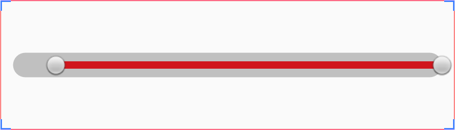
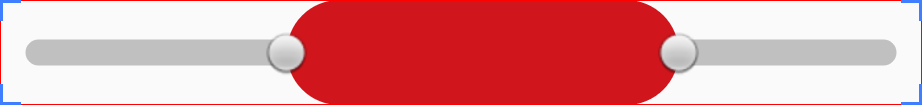
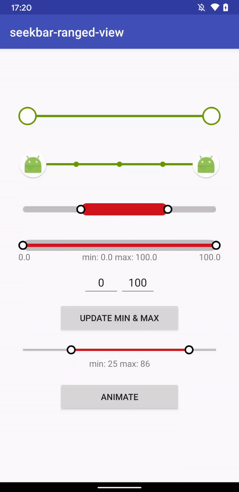

# SeekBarRangedView
[](https://android-arsenal.com/details/1/6115) [](https://appetize.io/app/652rkf2vptc91mrkqfd210vyvw)

A SeekBar restrained by a minimum and maximum value.

Back in 2014 I contributed to this [project](https://github.com/GuilhE/android-nickaknudson/commits/master) by adding a few functionalities to ___RangeSeekBar.java___. The repo had no activity since then, so I've decided to extend it and continue.
Credits must be shared with [Nick Knudson](https://github.com/nickaknudson) ;)

## Installation

SeekbarRangedView is distributed through [Maven Central](https://search.maven.org/artifact/com.github.guilhe/seekbar-ranged-view), [Jcenter](https://bintray.com/gdelgado/android/seekbar-ranged-view) and [Jitpack](https://jitpack.io/#GuilhE/SeekbarRangedView).

```groovy
implementation 'com.github.guilhe:seekbar-ranged-view:${LATEST_VERSION}'
```
 [](https://search.maven.org/search?q=g:com.github.guilhe%20AND%20seekbar-ranged-view) [ ](https://bintray.com/gdelgado/android/seekbar-ranged-view/_latestVersion)  

## Usage

Check out the __sample__ module where you can find a few examples of how to create it by `xml` or `java`.

Attributes accepted in xml:
```xml
<resources>
        <attr name="min" format="float"/>
        <attr name="max" format="float"/>
        <attr name="currentMin" format="float"/>
        <attr name="currentMax" format="float"/>
        <attr name="rounded" format="boolean"/>
        <attr name="backgroundColor" format="color"/>
        <attr name="backgroundHeight" format="dimension"/>
        <attr name="progressColor" format="color"/>
        <attr name="progressHeight" format="dimension"/>
        <attr name="thumbsResource" format="reference"/>
        <attr name="thumbNormalResource" format="reference"/>
        <attr name="thumbPressedResource" format="reference"/>
</resources>
```
Example:
```xml
<com.github.guilhe.views.SeekBarRangedView
        android:layout_width="match_parent"
        android:layout_height="wrap_content"
        custom:currentMin="10"
        custom:backgroundColor="#C0C0C0"
        custom:progressColor="@color/progress_bar_line"
        custom:backgroundHeight="10dp"
        custom:progressHeight="20dp"
        custom:rounded="true"/>
 ```

For `android:layout_height` you should use `"wrap_content"`:


otherwise you'll be adding "margins" to your view (ex, `android:layout_height="200dp"`):



If you want to change its height, use the `backgroundHeight` and/or `progressHeight` attributes instead:




There are many methods to help you customize this `View` by code. For more details checkout the __sample app__, _javadocs_ or the code itself.

## Sample


_Animation last update on September, 2020_

<a href='https://play.google.com/store/apps/details?id=com.github.guilhe.rangeseekbar.sample'></a>

## Dependencies

- [com.android.support:support-annotations](https://developer.android.com/topic/libraries/support-library/packages.html#annotations)

## Bugs and Feedback

For bugs, questions and discussions please use the [Github Issues](https://github.com/GuilhE/SeekbarRangedView/issues).

## LICENSE

Copyright (c) 2017-present, GuilhE.

Licensed under the Apache License, Version 2.0 (the "License");
you may not use this file except in compliance with the License.
You may obtain a copy of the License at

<http://www.apache.org/licenses/LICENSE-2.0>

Unless required by applicable law or agreed to in writing, software
distributed under the License is distributed on an "AS IS" BASIS,
WITHOUT WARRANTIES OR CONDITIONS OF ANY KIND, either express or implied.
See the License for the specific language governing permissions and
limitations under the License.