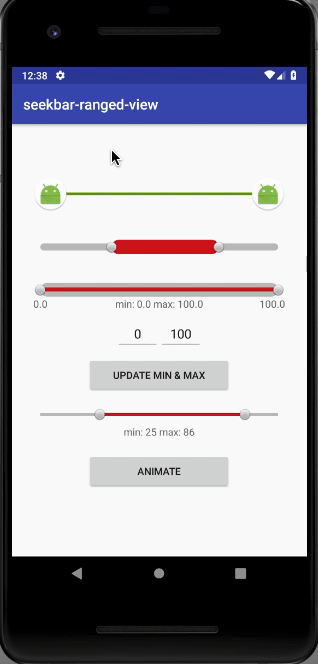

# SeekBarRangedView:
[](https://maven-badges.herokuapp.com/maven-central/com.github.guilhe/seekbar-ranged-view)  [  ](https://bintray.com/gdelgado/android/seekbar-ranged-view/_latestVersion) [](https://travis-ci.org/GuilhE/android-seekbar-ranged-view)

A SeekBar restrained by a minimum and maximum value.

Back in 2014 I contributed to this [project](https://github.com/GuilhE/android-nickaknudson/commits/master) by adding a few functionalities to ___RangeSeekBar.java___. The repo had no activity since then, so I've decided to extend it and continue.
Credits must be shared with [Nick Knudson](https://github.com/nickaknudson) ;)

#### Version 1.x

  - **August, 2017** - SeekBarRangedView


## Getting started

Include it into your project, for example, as a Gradle compile dependency:

```groovy
compile 'com.github.guilhe:seekbar-ranged-view:1.0.0'
```

#### How to use it

Check out the __sample__ module where you can find a few examples of how to create it by `xml` or `java`.

Attributes accepted in xml:
```xml
<declare-styleable name="SeekBarRangedView">
        <attr name="min" format="float"/>
        <attr name="max" format="float"/>
        <attr name="currentMin" format="float"/>
        <attr name="currentMax" format="float"/>
        <attr name="rounded" format="boolean"/>
        <attr name="backgroundColor" format="color"/>
        <attr name="backgroundHeight" format="dimension"/>
        <attr name="progressColor" format="color"/>
        <attr name="progressHeight" format="dimension"/>
        <attr name="thumbsResource" format="reference"/>
        <attr name="thumbNormalResource" format="reference"/>
        <attr name="thumbPressedResource" format="reference"/>
 </declare-styleable>
```
Example:
```xml
<com.github.guilhe.rangeseekbar.SeekBarRangedView
                android:layout_width="match_parent"
                android:layout_height="wrap_content"
                custom:currentMin="10"
                custom:backgroundColor="#C0C0C0"
                custom:progressColor="@color/progress_bar_line"
                custom:backgroundHeight="10dp"
                custom:progressHeight="20dp"
                custom:rounded="true"/>
 ```

For `android:layout_height` you should use `"wrap_content"`:


otherwise you'll be adding "margins" to your view (ex, `android:layout_height="200dp"`):


If you want to change its height, use the `backgroundHeight` and/or `progressHeight` attributes instead:


To customize this `View` by code, these are the available methods to do so:
```java
    public interface OnSeekBarRangedChangeListener {
        void onChanged(SeekBarRangedView view, double minValue, double maxValue);

        void onChanging(SeekBarRangedView view, double minValue, double maxValue);
    }
    
    public void setSeekBarRangedChangeListener(OnSeekBarRangedChangeListener listener) {}

    public float getMinValue() {}

    public float getMaxValue() {}

    public void setSelectedMinValue(float value) {}

    public void setSelectedMinValue(float value, boolean animate) {}

    public void setSelectedMinValue(float value, boolean animate, long duration) {}

    public double getSelectedMinValue() {}

    public void setSelectedMaxValue(float value) {}

    public void setSelectedMaxValue(float value, boolean animate) {}

    public void setSelectedMaxValue(float value, boolean animate, long duration) {}

    public double getSelectedMaxValue() {}

    public void setRounded(boolean rounded) {}

    public void setBackgroundHeight(float height) {}

    public void setProgressHeight(float height) {}
        
    public void setBackgroundColor(int red, int green, int blue) {}

    public void setBackgroundColor(int alpha, int red, int green, int blue) {}

    public void setBackgroundColor(Color color) {}

    public void setBackgroundColor(int color) {}

    public void setBackgroundColorResource(@ColorRes int resId) {}

    public void setProgressColor(int red, int green, int blue) {}

    public void setProgressColor(int alpha, int red, int green, int blue) {}

    public void setProgressColor(Color color) {}

    public void setProgressColor(int color) {}

    public void setProgressColorResource(@ColorRes int resId) {}

    public void setThumbsImage(Bitmap bitmap) {}

    public void setThumbsImageResource(@DrawableRes int resId) {}

    public void setThumbNormalImage(Bitmap bitmap) {}

    public void setThumbNormalImageResource(@DrawableRes int resId) {}

    public void setThumbPressedImage(Bitmap bitmap) {}

    public void setThumbPressedImageResource(@DrawableRes int resId) {}
```

For more details checkout _javadocs_ or the code itself.


 

## Binaries

Binaries and dependency information for Gradle, Maven, Ivy and others can be found at [https://search.maven.org](https://search.maven.org/#artifactdetails%7Ccom.github.guilhe%7Cseekbar-ranged-view%7C1.0.0%7Caar).

For Gradle:

```groovy
repositories {
    jcenter()
 }

dependencies {
    compile 'com.github.guilhe:seekbar-ranged-view:1.0.0'
}
```

and for Maven:
```groovy
<dependency>
    <groupId>com.github.guilhe</groupId>
    <artifactId>seekbar-ranged-view</artifactId>
    <version>1.0.0</version>
    <type>pom</type>
</dependency>
```

and for Ivy:
```groovy
<dependency org='com.github.guilhe' name='seekbar-ranged-view' rev='1.0.0'>
    <artifact name='seekbar-ranged-view' ext='pom' ></artifact>
</dependency>
```

<a href='https://bintray.com/gdelgado/android/seekbar-ranged-view?source=watch' alt='Get automatic notifications about new "seekbar-ranged-view" versions'></a>

## Dependencies

- [com.android.support:appcompat-v7](https://developer.android.com/topic/libraries/support-library/features.html#v7-appcompat)

## Bugs and Feedback

For bugs, questions and discussions please use the [Github Issues](https://github.com/GuilhE/android-seekbar-ranged-view/issues).

 
## LICENSE

Copyright (c) 2017-present, AndroidUtils Contributors.

Licensed under the Apache License, Version 2.0 (the "License");
you may not use this file except in compliance with the License.
You may obtain a copy of the License at

<http://www.apache.org/licenses/LICENSE-2.0>

Unless required by applicable law or agreed to in writing, software
distributed under the License is distributed on an "AS IS" BASIS,
WITHOUT WARRANTIES OR CONDITIONS OF ANY KIND, either express or implied.
See the License for the specific language governing permissions and
limitations under the License.
